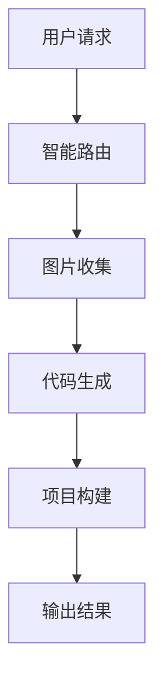

# AI Code Assistant - 智能代码生成助手

一个基于AI的智能代码生成平台，支持多种代码生成模式和项目构建。

## 🚀 功能特性

### 多种代码生成模式
- **HTML模式**: 生成单页面HTML文件
- **多文件模式**: 生成包含多个文件的完整项目结构
- **Vue项目模式**: 生成完整的Vue 3项目，支持组件化开发和响应式设计 [1](#0-0) 

### 智能工作流
基于LangGraph4j的多步骤代码生成工作流，包含：
- 智能路由：自动识别最适合的代码生成模式
- 图片收集：AI驱动的项目相关图片资源收集
- 代码生成：流式代码生成与实时响应
- 项目构建：自动化的项目构建和打包 [2](#0-1) 

### Vue项目特性
- Vue 3.x + Composition API + `<script setup>`语法
- Vite构建工具，支持子路径部署
- Vue Router 4.x，使用hash模式路由
- 响应式设计，支持桌面端、平板端、移动端
- 原生CSS实现，无额外依赖 [3](#0-2) 

## 🛠 技术栈

### 后端技术
- **Spring Boot**: 应用框架
- **LangChain4j**: AI集成框架
- **LangGraph4j**: 工作流编排
- **MySQL**: 数据存储
- **Redis**: 缓存和会话管理
- **Reactor**: 响应式编程

### 前端技术（生成项目）
- **Vue 3.x**: 前端框架
- **Vite**: 构建工具
- **Vue Router**: 路由管理

## 📦 快速开始

### 环境要求
- Java 17+
- Node.js 18+
- MySQL 8.0+
- Redis 6.0+

### 安装步骤

1. **克隆项目**
```bash
git clone https://github.com/arousa1/Ai-Code-Gen.git
cd Ai-Code-Gen
```

2. **配置数据库**
```sql
CREATE DATABASE ai_code_assistant;
```

3. **修改配置**
编辑 `src/main/resources/application.yml` 文件，配置数据库连接信息 [4](#0-3) 

4. **启动应用**
```bash
mvn spring-boot:run
```

应用将在 `http://localhost:8123` 启动 [5](#0-4) 

## 📚 API文档

启动应用后，访问以下地址查看API文档：
- Swagger UI: `http://localhost:8123/api/swagger-ui.html`
- OpenAPI文档: `http://localhost:8123/api/v3/api-docs` [6](#0-5) 

## 🏗 架构概览

### 核心组件
- **AiCodeGeneratorFacade**: 代码生成的统一入口
- **JsonMessageStreamHandler**: 处理流式响应和工具调用
- **VueProjectBuilder**: Vue项目的构建和打包
- **ToolManager**: AI工具的管理和执行 [7](#0-6) 

### 工作流程


## 🔧 配置说明

### Vue项目生成约束
- 总输出token数 < 20,000
- 文件总数 < 30个
- 必须使用工具调用写入文件
- 禁止使用状态管理库、类型校验库、代码格式化库 [8](#0-7) 

## 🤝 贡献指南

欢迎提交Issue和Pull Request来改进项目！

## 📄 许可证

本项目采用MIT许可证，详见LICENSE文件。

## 📞 联系方式

如有问题或建议，请通过以下方式联系：
- 提交Issue: [GitHub Issues](https://github.com/arousa1/Ai-Code-Gen/issues)

---

## Notes

这个README基于项目的实际代码结构和配置文件生成。主要信息来源于：
- Vue项目模式的系统提示文件，详细说明了技术栈和约束条件
- 应用配置文件，包含了端口、数据库等配置信息
- 核心Java类，展示了项目的架构设计
- LangGraph4j工作流节点，说明了多步骤代码生成流程

README中提到的所有技术特性和配置都基于实际代码实现，确保了准确性和实用性。

Wiki pages you might want to explore:
- [Vue Project Mode (arousa1/Ai-Code-Gen)](/wiki/arousa1/Ai-Code-Gen#4.2)
- [LangGraph4j Agent Workflow (arousa1/Ai-Code-Gen)](/wiki/arousa1/Ai-Code-Gen#5)

